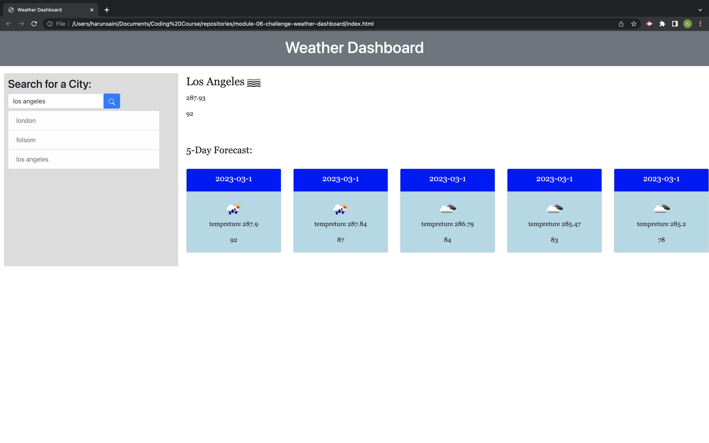

# Weather Dashboard

This is a weather dashboard that allows you to search for current and future weather conditions for any city in the world. The dashboard provides current weather conditions such as the city name, the date, an icon representation of weather conditions, the temperature, the humidity, and the wind speed. It also provides future weather conditions in a 5-day forecast format that displays the date, an icon representation of weather conditions, the temperature, the wind speed, and the humidity.

## Getting Started
To get started, simply open the weather dashboard in your web browser. You will see a form input where you can enter the name of the city for which you would like to see the weather conditions. Once you enter the name of the city and click on the search button, the dashboard will display the current and future weather conditions for that city. The city you searched for will also be added to the search history.

## Viewing Weather Conditions
The weather dashboard displays current weather conditions and future weather conditions for any city in the world. To view current weather conditions, simply search for the city using the form input. The dashboard will display the city name, the date, an icon representation of weather conditions, the temperature, the humidity, and the wind speed. To view future weather conditions, simply scroll down to the 5-day forecast section of the dashboard. The forecast will display the date, an icon representation of weather conditions, the temperature, the wind speed, and the humidity.

## Viewing Search History
The search history section of the weather dashboard displays a list of all the cities that you have searched for. To view weather conditions for a city that you have previously searched for, simply click on the city name in the search history. The dashboard will display the current and future weather conditions for that city.

## link to repository
https://github.com/193G/module-06-challenge-weather-dashboard

## link to page 
https://193g.github.io/module-06-challenge-weather-dashboard/

## contact me on github  
https://github.com/193G

## Built With
HTML
CSS
JavaScript
OpenWeatherMap API
License
This project is licensed under the MIT License - see the LICENSE.md file for details.

## Acknowledgments
OpenWeatherMap API for providing the weather data.

## instructions on how to view 

